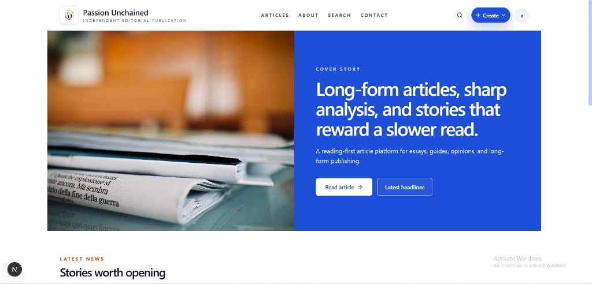
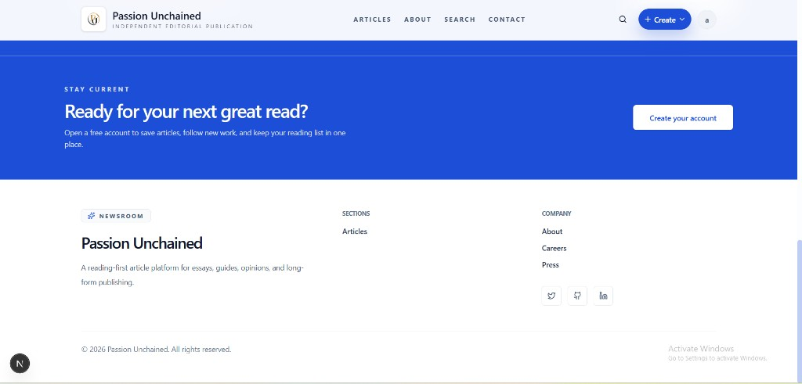
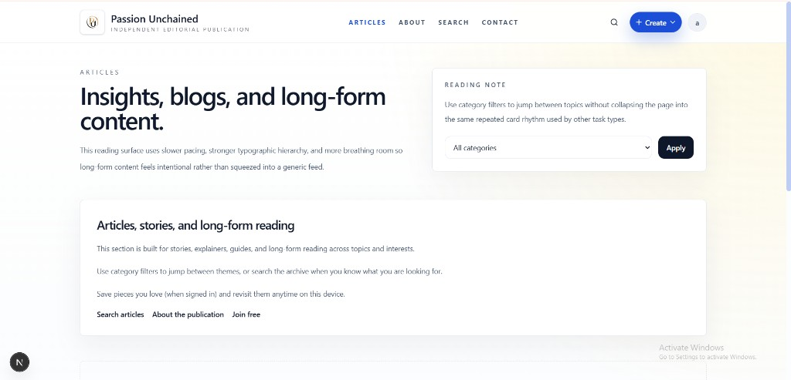
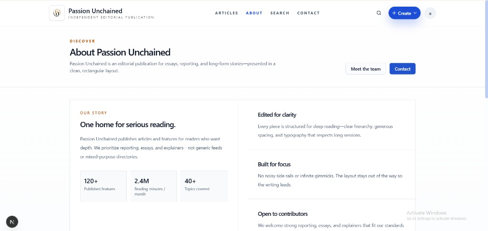
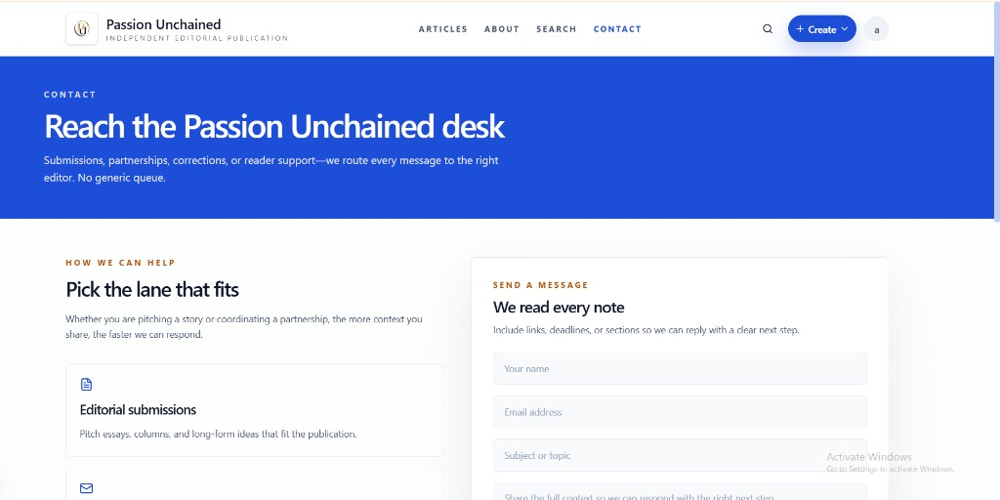

# Passion Unchained

Independent editorial publication site: article-first reading, royal blue accents, and an editorial layout built with Next.js.

## UI

Screenshots from the current interface:

### Homepage — cover story hero



### Homepage — stay current band and footer



### Articles — reading surface



### About



### Contact



## Development

```bash
pnpm install
pnpm dev
```

See `deploy/README.md` for deployment notes.
